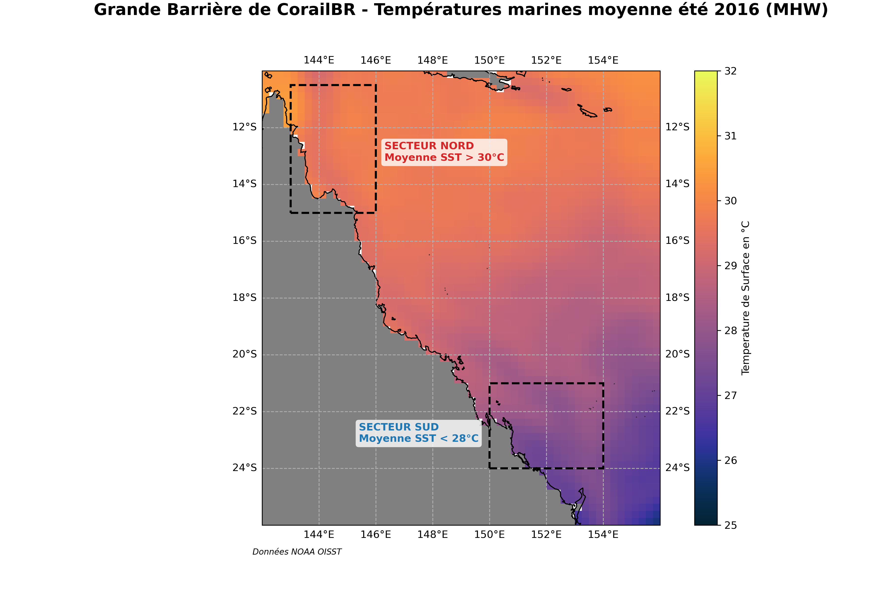
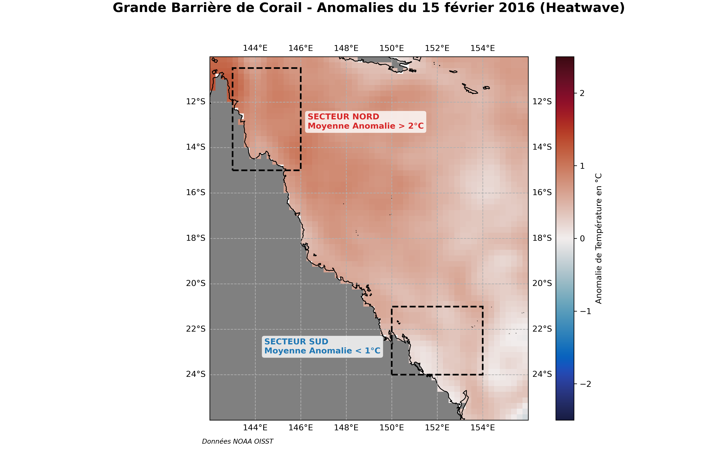
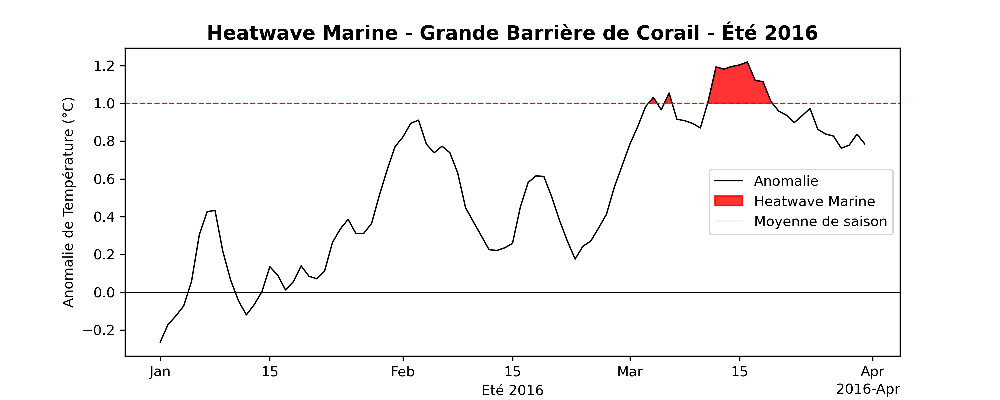
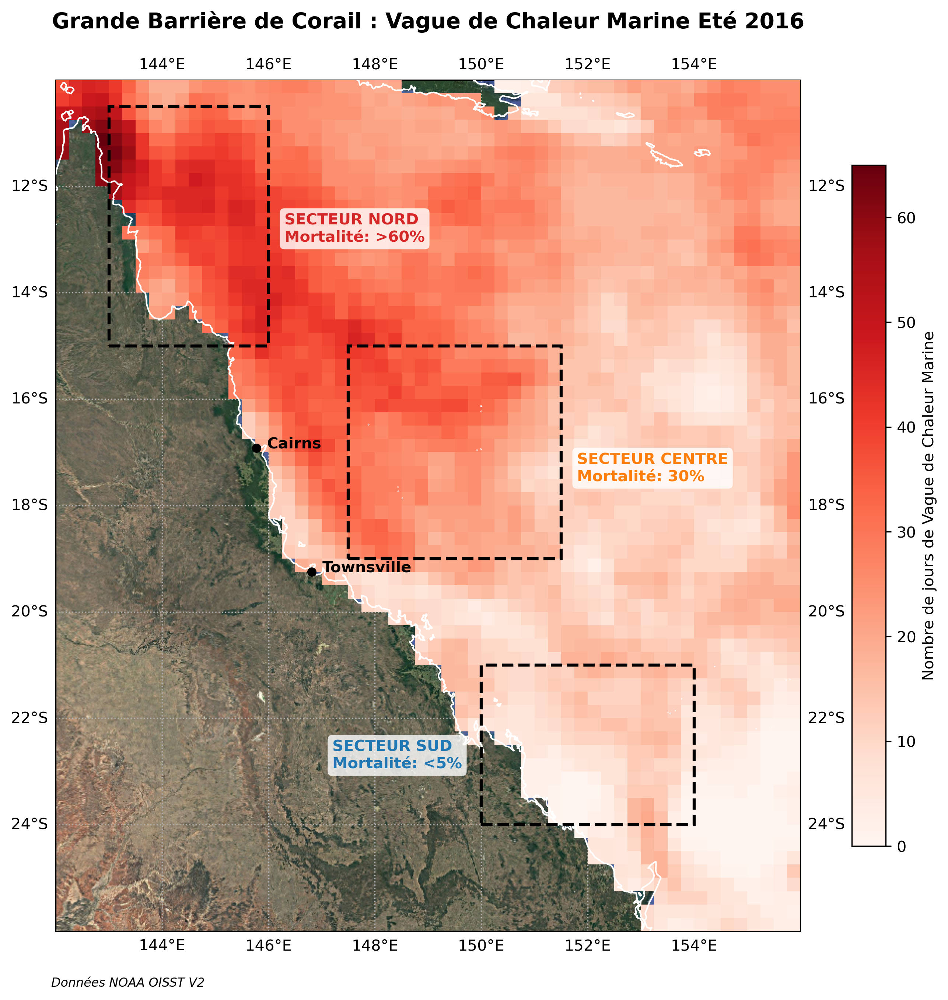
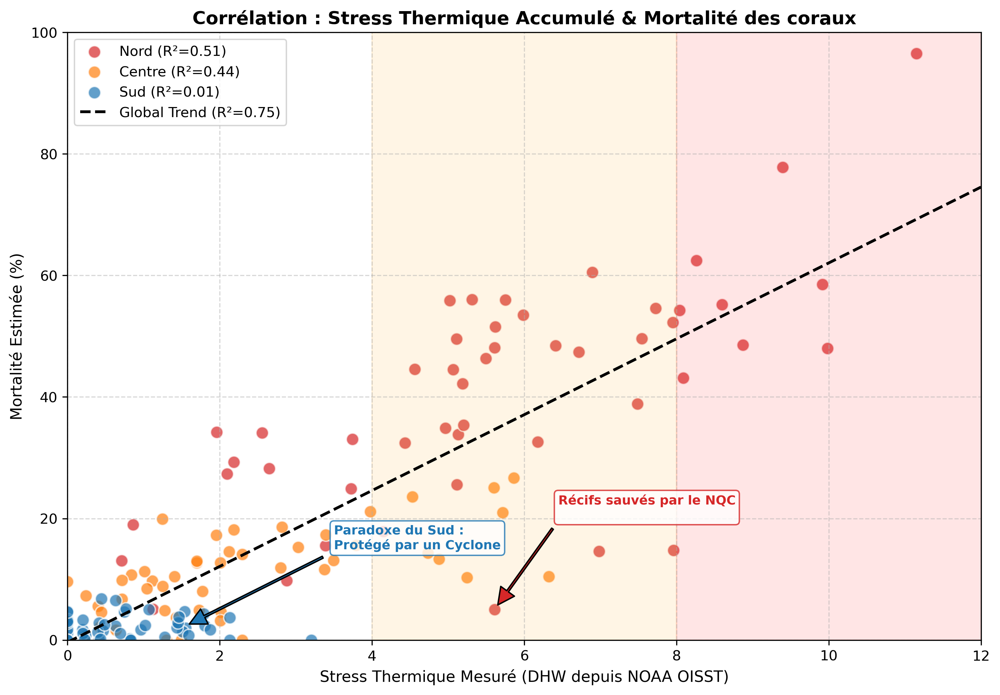
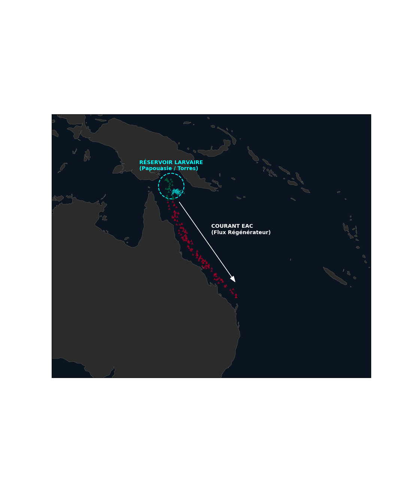

# Projet Data Science Océanographique : Autopsie d'une Vague de Chaleur sur la Grande Barrère de Corail (GBR 2016) 🌊 


**Auteur :** Maxence Lefour  

## Table des Matières
1. [Genèse & Objectifs](#-la-genèse-du-projet)
2. [Le Diagnostic Thermique](#1-le-diagnostic--la-bulle-de-chaleur-janvier-mars-2016)
3. [L'Impact Biologique](#2-limpact-biologique--satellite-vs-réalité)
4. [Le Paradoxe du Sud (Cyclone Winston)](#3-le-paradoxe-du-sud--le-sauveur-winston)
5. [La Régénération (Courant EAC)](#4-la-régénération--le-tapis-roulant-australien-eac)
6. [Conclusion & Leçons](#-ce-que-les-données-nous-ont-appris)
7. [Installation & Usage](#-explorer-le-code)

---


## La Genèse du Projet

Passionné par l'océanographie et en pleine montée en compétence en Data Science, j'ai cherché un sujet qui me permettrait de lier ces deux univers.

L'épisode de blanchissement de 2016 est un cas d'école. J'ai voulu dépasser les cartes statiques que l'on voit dans les médias pour construire ma propre analyse spatio-temporelle. Ce projet a été mon terrain d'apprentissage pour maîtriser la manipulation de données climatiques complexes (NetCDF) et la visualisation scientifique.

Ce que j'ai découvert en codant ce notebook m'a surpris : **l'histoire est bien plus compliquée (et intéressante) que prévu.**

---

### Le Contexte

En 2016, la **Grande Barrière de Corail (GBR)** a subi l'épisode de blanchissement le plus catastrophique de son histoire moderne. Sous l'effet combiné d'un *El Niño* intense et du réchauffement anthropique, une "bulle" d'eau chaude a stagné sur le nord-est de l'Australie.

Cependant, l'analyse des données révèle une anomalie fascinante : **la mortalité n'a pas été uniforme.**
Alors que le Nord a été dévasté (~67% de mortalité), le Sud est resté quasi-intact (<1% de mortalité). 
* Pourquoi le Nord a-t-il été anéanti ?
* Pourquoi certains récifs du Nord ont-ils survécu contre toute attente ?
* Pourquoi le Sud a-t-il été épargné alors que les modèles prédisaient le pire ?
* Quel futur pour les coraux de la Grande Barrière de Corail ?

### Objectifs de l'étude

Ce projet ne se contente pas de visualiser la catastrophe. Nous allons utiliser la **Data Science spatio-temporelle** pour prouver les mécanismes physiques et biologiques qui ont dicté la survie ou la mort des récifs :
1.  **Le Diagnostic (Xarray/NOAA) :** Quantifier l'anomalie thermique (SST) et le stress cumulé (DHW).
2.  **L'Enquête (Pandas/Scipy) :** Corréler ces données satellites avec la mortalité biologique réelle (Hughes 2017).
3.  **Le Paradoxe (Cartopy) :** Révéler le rôle inattendu du **Cyclone Winston** comme "climatiseur naturel" du Sud.
4.  **L'Espoir (Simulation) :** Modéliser la dispersion larvaire via le courant **EAC (East Australian Current)** pour comprendre la régénération.


---

## 1. Le Diagnostic : La "Bulle" de Chaleur (Janvier-Mars 2016)

**La Science derrière la donnée :** Les coraux vivent en symbiose avec des micro-algues (zooxanthelles). Au-delà d'un seuil thermique (généralement 1°C au-dessus de la moyenne saisonnière maximale ou *MMM*), cette symbiose rompt : c'est le blanchissement.

Pour cette analyse, nous utilisons les données **NOAA OISST v2** (Optimum Interpolation Sea Surface Temperature). Ce sont des données satellites calibrées par des bouées in-situ, offrant une résolution quotidienne depuis 1981.

**Ce que nous cherchons :** Nous allons calculer la moyenne de température sur l'été austral (Jan-Mars) pour identifier la **persistance** de la chaleur, bien plus mortelle qu'un pic isolé.




*Comparaison avec la climatologie (historique) :*
Lorsque l'on compare l'été 2016 aux moyennes historiques (calcul de la moyenne de la température marine des 30 dernières années - MMM), on identifie une anomalie dépassant 2°C sur certaines zones. Ces **Vagues de Chaleur Marines (MHW)** deviennent critiques lorsqu'elles s'étalent dans le temps.



On remarque que la zone Nord est la plus touché par ces anomalies de vague de chaleur, dépassant dans certains cas les **+2°C en moyenne par rapport au MMM** sur l'été 2016.
Par curiosité, quelle est la durée moyenne de jours de vague de chaleu sur l'ensemble de la GBR sur l'été 2016 ?



**11 jours** de vague de chaleur marine est la moyenne de l'ensemble de la GBR, pour aller plus loin et mettre en corrélation le stress thermique avec le blanchissement des coraux, il est nécessaire d'avoir une visualisation de la vague de chaleur marine sur des zones plus précises afin idenfitifer les zones les plus touchées de la GBR.



On identifie 3 **zones de Vagues de Chaleur Marine** (MHW) de la Grande Barrière de Corail:
- Zone Nord (MHW longue / > 40j)
- Zone Centrale (MHW moyenne / 30j)
- Zone Sud (MHW courte / < 10j)

A première vue, il semble y avoir une corrélation entre le nombre de jour de Vague de Chaleur Marine (MHW) & le taux de mortalité des coraux.

---

## 2. L'Impact Biologique : Satellite vs Réalité

C'est ici que l'océanographie rencontre la biologie. Le satellite voit le stress (**DHW - Degree Heating Weeks**), mais seule l'observation sous-marine voit la mort.

### Les Faits Scientifiques (Hughes et al. 2017)

L'étude publiée dans *Nature* a établi un gradient terrifiant pour 2016 :
* **Nord (Lat > -15°S) :** La "zone de la mort". Des DHW dépassant souvent 8 à 10. Résultat : **67%** de mortalité moyenne sur les eaux peu profondes.
* **Centre :** Une zone de transition. Bien que stressés, beaucoup de coraux ont blanchi sans mourir immédiatement (mortalité ~6% en 2016, aggravée en 2017).
* **Sud (Lat < -20°S) :** Le miracle. Mortalité négligeable (<1%).

### La Nuance Océanographique (Huang et al. 2024)

L'analyse purement statistique montre des "anomalies" dans le Nord : certains récifs ont survécu malgré la chaleur satellite.
**L'explication ? Le courant NQC (North Queensland Current).**
Ce courant de bord génère des **upwellings** (remontées d'eau froide) le long du talus continental. Ces eaux froides, invisibles pour les satellites basse résolution qui mesurent la surface, ont baigné les racines des récifs, créant des micro-refuges thermiques.

*Le graphique ci-dessous modélise cette relation complexe entre le stress thermique satellitaire et la mortalité biologique réelle.*




On remarque bien une corrélation entre le nombre de jours de Vague de Chaleur Marine (ici en semaine : DHW) et le Taux de Mortalité des coraux.
Cependant, le SUD est bien loin d'avoir un taux de mortalité cohérent par rapport aux nombres de semaine de vague de chaleur. Pourquoi ?

| Zone   | DHW      | Mortality (%) |  R²        |
|--------|----------|---------------|------------|
| Nord   | 5.8      | 40.8          | 0.51       |
| Centre | 2.3      | 10.5          | 0.44       |
| Sud    | 0.8      | 2.3           | 0.006      |

*Note : Le R² quasi-nul du Sud prouve qu'un autre facteur a découplé le stress thermique de la mortalité.*

---

## 3. Le "Paradoxe du Sud" : Le Sauveur Winston

Pourquoi le Sud a-t-il été épargné alors que l'eau était chaude partout ailleurs au début de l'été ?
La réponse vient du ciel : **Le Cyclone Tropical Winston (Février 2016).**

### La Physique du "Mixing"

Un cyclone agit comme une cuillère géante dans une tasse de café.
1.  **Ekman Pumping :** Les vents violents tournant autour de l'œil aspirent l'eau profonde vers la surface.
2.  **Mélange Vertical :** La couche de surface chaude (>30°C) est mélangée avec la thermocline froide située 30-50m plus bas.
3.  **Refroidissement Latent :** L'évaporation massive due au vent extrait de la chaleur de l'océan.

**L'Analyse :**

Bien que Winston n'ait pas frappé directement la côte australienne (il a dévasté les Fidji), sa trajectoire rétrograde dans la Mer de Corail a suffi à faire chuter la température de l'eau de **~2°C à 3°C** dans le secteur Sud, pile au moment critique (février).

*Animation simplifiée du passage du cyclone et refroidissement associé :*

Données de : https://www.australiasevereweather.com/tropical_cyclones/2015_2016/


## 4. La Régénération : Le "Tapis Roulant" Australien (EAC)

Après la dévastation, comment le récif se régénère-t-il ? Les coraux sont des animaux fixés (sessiles). Ils ne peuvent pas migrer. La survie de l'espèce dépend donc de la **Connectivité Larvaire**.

### L'East Australian Current (EAC)
C'est le courant rendu célèbre par le film *Le Monde de Nemo*. C'est un puissant courant de bord ouest qui transporte des masses d'eau chaude (et tout ce qui flotte dedans) du Nord vers le Sud.

**L'Hypothèse du "Reseeding" (Réensemencement) :**
Les récifs du Nord lointain et de Papouasie, moins touchés par l'activité humaine locale, servent de réservoirs génétiques. Lors de la ponte massive (généralement en novembre/décembre), des milliards de larves sont relâchées.
Si elles sont capturées par l'EAC, elles peuvent voyager sur des centaines de kilomètres pour recoloniser les récifs morts du Nord, Sud ou du Centre.

*La simulation ci-dessous modélise ce transport lagrangien de particules (larves) pour identifier les zones de connectivité potentielles.*



---

## Ce que les données nous ont appris

Cette analyse de l'événement 2016 démontre que la **Data Science** est un outil puissant pour décoder les écosystèmes complexes. Nous avons pu vérifier trois phénomènes majeurs :

1.  **La Non-Linéarité du Vivant :** La relation entre chaleur (DHW) et mort n'est pas une simple ligne droite. Elle est modulée par des seuils biologiques et des refuges locaux (le courant NQC décrit par Huang et al.).

2.  **L'Interconnexion Climatique :** Le destin de la Grande Barrière ne se joue pas seulement dans l'eau, mais dans l'atmosphère. Sans le cyclone Winston, le Sud aurait probablement subi le même sort que le Nord. C'est un rappel brutal de la part de hasard (la météo) dans la résilience climatique.

3.  **L'Espoir Hydrodynamique :** La simulation de l'EAC nous rappelle que l'océan est un système connecté. Aucune zone marine protégée n'est une île. La protection des "sources" de larves au Nord est vitale pour la survie des "puits" au Sud.

**Le mot de la fin :**
Si 2016 a été une tragédie écologique, elle a aussi été un laboratoire grandeur nature. Les données nous montrent que si nous limitons le réchauffement global, les mécanismes naturels de l'océan (courants, cyclones, upwellings) peuvent encore offrir des chances de survie à ces récifs coraliens. Mais la fenêtre d'opportunité se referme : avec des événements rapprochés (2017, 2020, 2022), le temps de récupération offert par ces climatiseurs naturels devient insuffisant.

---
*Projet réalisé avec Python (Xarray, Pandas, Cartopy). Données publiques NOAA & Copernicus.*

Ce projet est construit entièrement en Python, en utilisant la stack scientifique spatiale :

* **xArray & NetCDF4 :** Pour manipuler les cubes de données multidimensionnels (Temps, Lat, Lon).
* **Cartopy :** Pour les projections géographiques précises.
* **Pandas & Scipy :** Pour la modélisation statistique des taux de mortalité.
* **Matplotlib & Cmocean :** Pour des visualisations océanographiques fidèles.

## Sources & Crédits

Ce travail s'appuie sur la littérature scientifique récente :
* *Hughes et al. (Nature, 2017)* : Global warming and recurrent mass bleaching.
* *Huang et al. (Sci. Total Env., 2024)* : Marine heatwaves mechanisms & refugia.
* *Wolanski et al. (2017)* : The Gulf of Carpentaria heated Torres Strait.

## Explorer le code

Le notebook est structuré pour être lu comme une enquête scientifique.

```bash
# 1. Cloner le projet
git clone [https://github.com/max-oceano/gbr-marine-heatwave-2016.git](https://github.com/max-oceano/gbr-marine-heatwave-2016.git)

# 2. Installer les dépendances
pip install -r requirements.txt

# 3. Lancer l'analyse
jupyter notebook 06_Master_notebook.ipynb
